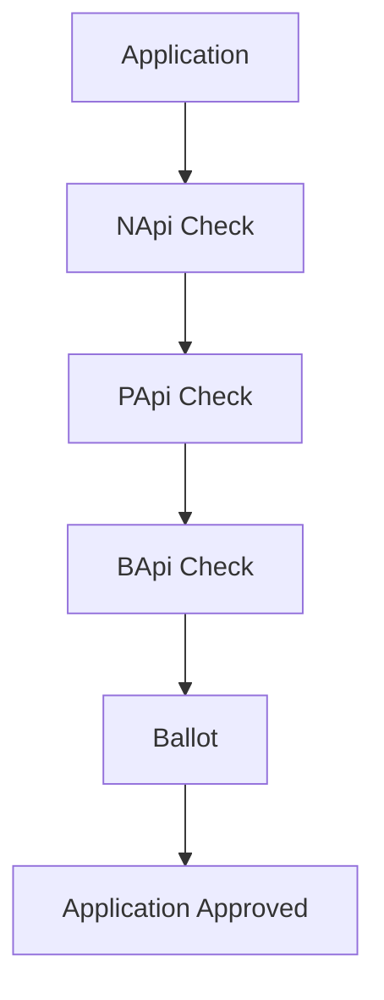

# FPFH
Free plots and free house scheme - Laravel and Blade template

```mermaid
graph TD
    Application --> NApi["NApi Check"]
    NApi --> PApi["PApi Check"]
    PApi --> BApi["BApi Check"]
    BApi --> Ballot["Ballot"]
    Ballot --> Approval["Application Approved"]
```
